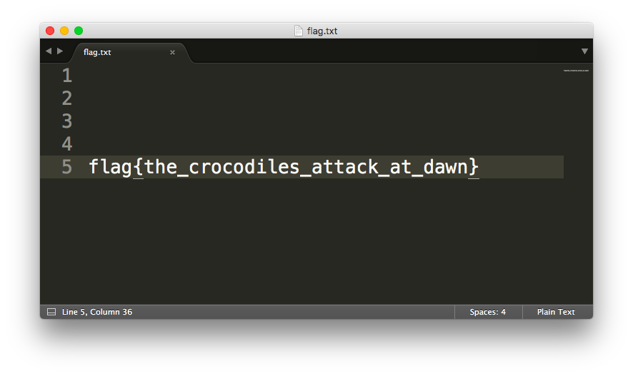

### Problem Statement:
```txt
This crocodile has many secrets. If you poke him enough, he will reveal the secret of his people.
```

---

We've been given the following image:


We can try and get some info about the file using several tools.
```zsh
$ exiftool secrets.jpg
Nope nothin here :P

$ strings secrets.jpg | grep "flag"
flag.pngUT
flag.pngUT
```

Well, this is certainly interesting... there's somethin named "flag.png" in there, maybe we can try and extract this?

We can use `binwalk` for the ease of singling out what tool to use, or just straight up get the file.
```zsh
$ binwalk secrets.jpg


DECIMAL       HEXADECIMAL     DESCRIPTION
--------------------------------------------------------------------------------
0             0x0             JPEG image data, JFIF standard 1.01
30            0x1E            TIFF image data, big-endian, offset of first image directory: 8
23256         0x5AD8          Zip archive data, at least v2.0 to extract, compressed size: 45158, uncompressed size: 52221, name: flag.png
68558         0x10BCE         End of Zip archive, footer length: 22

$ unzip secrets.jpg
Archive:  secrets.jpg
warning [secrets.jpg]:  23256 extra bytes at beginning or within zipfile
  (attempting to process anyway)
  inflating: flag.png

# or rather use:
$ binwalk -e secrets.jpg
# now view "_secrets.jpg.extracted/flag.png"
```

The file:


---

### The Flag:
    flag{the_crocodiles_attack_at_dawn}


Link to the challenge: [hidden files](https://training.majorleaguecyber.org/challenges#hidden%20files-6)
